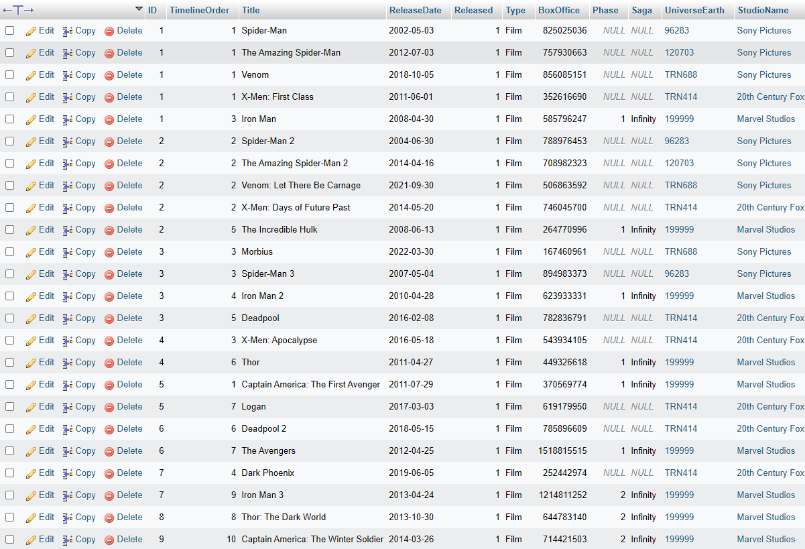

# Marvel Database

Welcome to the Marvel Database, a comprehensive MySQL database crafted for the IN1013 Databases coursework. This repository contains structured data about Marvel _projects_, _timelines_, and _characters_, designed to facilitate the exploration and sorting of information related to Marvel movies, their release sequences, timeline orders, and the appearances of various characters in these projects.

## Screenshots

### Projects Table


This screenshot displays the 'Projects' table from the Marvel Database, showcasing a detailed view of various Marvel projects such as movies and series. The table includes critical information such as the title, release year, box office earnings, and timeline order. This view helps users quickly understand the scope and details of each project within the Marvel Cinematic Universe, illustrating the database's capability to organize and present complex data efficiently.

### ER Diagram


This image presents the Entity-Relationship (ER) diagram of the Marvel Database, highlighting the structured relationships between different entities such as Studios, Projects, Characters, and Crew Members. The diagram provides a clear overview of how the tables are interconnected, making it easier for developers and database administrators to understand the data model and relationships underlying the database architecture. It serves as an essential visual aid for those looking to extend, modify, or query the database.

## Features

- **Project Listings**: Access detailed records of Marvel movies and series, including titles, release years, and box office earnings.
- **Character Insights**: Explore which characters appear in each project and track their status across the Marvel universe.
- **Timeline Ordering**: View projects organized by their timeline within the Marvel Cinematic Universe, providing a chronological understanding of the storyline.
- **Advanced Search Capabilities**: Utilize complex SQL queries to filter, sort, and retrieve specific data points across multiple tables.

## Learning Outcomes

Through the development of the Marvel Database, I have achieved the following learning outcomes:

- **Expanded SQL Knowledge**: Enhanced proficiency in SQL, including queries for data manipulation and retrieval.
- **Advanced Database Concepts**: Gained insights into advanced database structures and relationships. Learned how to create robust Entity-Relationship (ER) diagrams using Visual Paradigm, which improved my ability to visually represent and design complex database schemas.
- **Data Manipulation**: Mastered the skills to create, insert, update, and delete tables, as well as how to manage views within a MySQL environment.
- **Complex Queries**: Developed the ability to construct and execute complex SQL queries that integrate multiple aspects of database interaction.


## How to Use

To get started with the Marvel Database, clone this repository and import the `marvel_database.sql` file into your MySQL environment. Ensure you have MySQL installed and configured on your machine. Here are the steps to import the database:

```bash
mysql -u addf125 -p
CREATE DATABASE marvel_db;
USE marvel_db;
SOURCE MarvelDatabase.sql;
```
